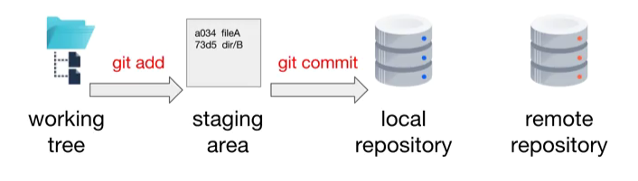

# Our First Repository

This module gets you started using Git. It provides the foundation for the rest of the course. You will install Git and/or Sourcetree, create a local repository, create a commit, create a remote repository and push commits to a remote repository. You have the option of doing the hands-on labs using the Sourcetree graphical Git client and/or using a command line.

# Introduction to GIT and main commands

## DevOps and Git in a Nutshell

### Notes

- Waterfall approach: Plan -> Develop -> Release  
- After a merge, the new branch contains the new features  
- Request to merge (a branch X to the master branch): Pull request  
- Continuous improvement- **commits**  
- Simultaneous stability and development- **branches**  
- Improved quality- **pull request**  

### Questions

Which one of these statements about continuous improvement is true?  
- [ ] Small batch size leads to continuous improvement.  
- [x] Continuous improvement applies to features, but not bugs.  
- [ ] Continuous improvement applies to bugs, but not features.  

Which one of these statements about commits is true?  
- [ ] The collection of commits contain the project's history.  
- [x] A commit contains the project's history.  
- [ ] A commit contains only the changes to the project since the previous commit.  

Which one of these statements about branches is true?  
- [ ] Only one branch per project is allowed.  
- [x] Branches enable independent development of the project.  
- [ ] All commits must belong to the master branch.  

Which one of these statements about pull requests is true?  
- [ ] A pull request is a request to create a branch.  
- [ ] A pull request is a request to download the project.  
- [x] Pull requests can include team review and testing, improving product quality.  

---
## Git Overview

### Notes

- Content: Usually any type (most common, source code, automated tests, server configuration, documentation, websites etc.)  
- In Distributed Version Control System (DVCS) each user has a local project history (repository) where users can work offline and can be easily syncronized.

### Git syntax

```
$ git- [command] [--flags] [arguments]
$ git help [command]                    # git help init
```

Setting the user name and email

```
# set user name and email
$ git config --global user.name "Name"
$ git config --global user.email "name@server.com"
```

Checking the user name and address

```
$ git config user.name
$ git config user.email
```


### Questions

Which one of the following statements about version control is true?  
- [ ] Version control only manages source code.  
- [ ] You must be online to use distributed version control.  
- [x] With distributed version control, each user has a local copy of the project history.  

Which one of the following statements about Git is true?  
- [ ] A commit only holds the changes to a project since the previous commit.  
- [ ] Git is owned by a single company.  
- [x] Git can be used while offline.  

---
## Git Locations

### Notes

- Working tree: a single commit's directories and files  
- Staging area (index): files that are planned for the next commit  
- Local repository: contains all the commits of the project (the version history)  
- Remote repository: contains the commits of the project (usually in the cloud)  

- Project Directory: Contains the working tree, the staging area and the local repository  

```
MyProject
   |- working tree
   |- .git/
```

Adding a file to the staging area and removing file from the staging area:  

```
$ git add <file>
$ git rm --cached <file>
```
Check the last commits performed, where ``--oneline`` shows a condensed version of the commit and ``-#`` limit the log to the most recent # commits.  

```
$ git log
$ git log --oneline -2
```

The pipeline of GIT is illustrated in the image below:  




### Questions

Which one of these statements is true?  
- [x] The staging area contains a list of files that will be in the next commit.  
- [ ] The working tree is also called the index.  
- [ ] The working tree contains the history of the project.  

Which one of these statements is true?  
- [ ] The project directory contains the remote repository.  
- [ ] The project directory contains the local and remote repositories.  
- [x] If you delete your project directory, you are also deleting your local repository.  

Which of the following is not in the project directory?  
- [ ] Local repository.  
- [x] Remote repository.  
- [ ] .git directory.  
- [ ] Working tree.  

Which one of the following statements is true?  
- [ ] A staged file will show as untracked.  
- [x] A staged file will be part of the next commit.  
- [ ] A staged file will show as modified.  

Which one of the following statements is true?  
- [ ] A commit always contains only one file.  
- [ ] A commit message is not part of the project history.  
- [x] The History tab contains the commits of the project.  

Which one of the following statements is true?  
- [ ] A staged file will show as modified.  
- [x] A staged file will be part of the next commit.  
- [ ] A staged file will show as untracked.  

Which one of the following statements is true?  
- [ ] A commit always contains only one file.  
- [x] The 'git log' command lists the commits of the project.  
- [ ] A commit message is not part of the project history.  

---
## Create a Remote Repository

### Notes

| Have a local repository? | Task             |
|--------------------------|------------------|
| no                       | clone the remote |
| yes                      | add the remote   |

Cloning a repository:

```
$ git clone <url.git> [localname]
```

Check information about the remote repository

``` 
$ git remote --verbose
```

Adding a remote repository to the local repository

```
$ git remote add origin <url.git>
```

Pushing content to the remote repository

```
$ git push [-u] [<repository>] [<branch>]
```
 where ``-u`` tracks the branch (``--set-upstream``)


### Questions

Which one of the following statements is true?  
- [x] A remote repository URL usually ends with '.git'.  
- [ ] A remote repository is located in the working tree.  
- [ ] Creating a commit adds it to the remote repository.  

Cloning creates a remote repository.  
- [ ] True  
- [x] False  

If you start with only a local repository containing five commits, how do you set up a remote repository containing those five commits?  
- [ ] Clone a remote repository, then push.  
- [ ] Clone the local repository, then push.  
- [x] Create a remote repository, add the remote repository to the local repository, then push.  
