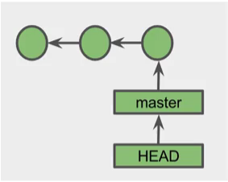
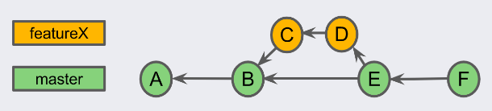
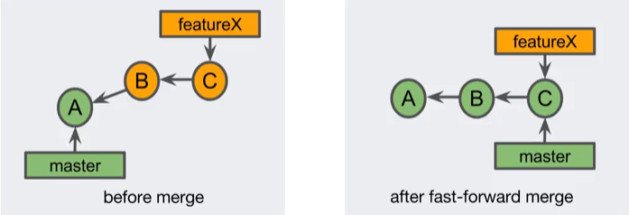
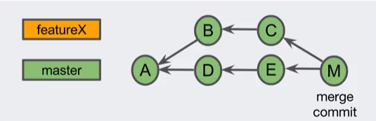
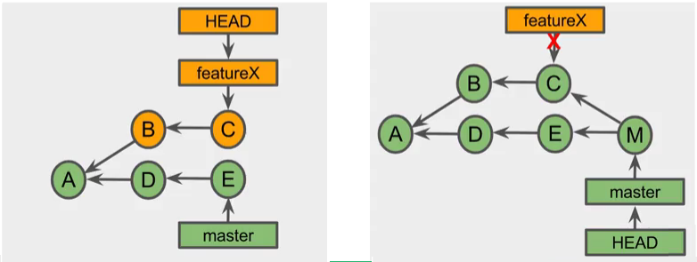
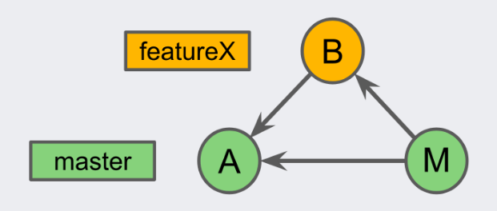
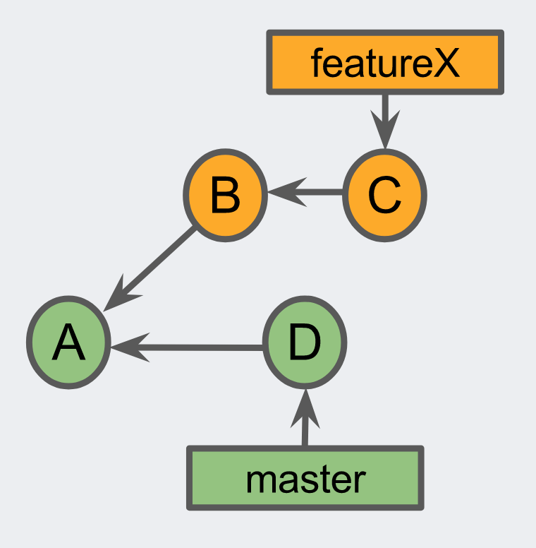
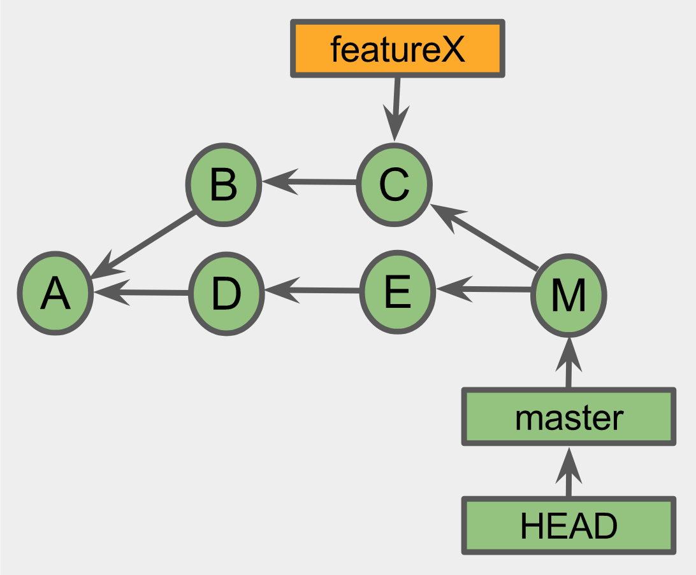

# Branching and Merging I

## GIT IDs

### Notes

- Viewing graphs in GIT

```
$ git log --oneline --graph
```

GIT Objects:
1. Commit object: A small text file
2. Annotated tag: A reference to a specific commit
3. Tree: Directories and filenames
4. Blob: The content of a file in the project

GIT IDs
- The name of a Git object
- 40-character hexadecimal string
- aka. object ID, SHA-1, hash or checksum

GIT IDs are usually shortened to the first 4 or 7 characters

### Questions

Which one of these statements is true?
- [ ] A circular graph can not be directed.
- [x] A directed acyclic graph can not be circular.
- [ ] A directed graph can not be circular.

Which one of the following is true?
- [x] Git models the commit history with a DAG.
- [ ] A commit points to its children.
- [ ] Git models the working tree with a DAG.

Which one of the following statements is true?
- [x] A Git object's name is the same as its Git ID.
- [ ] Full Git IDs are always shown in the Sourcetree interface.
- [ ] A slight change to a file's content will create a slight change to the SHA-1 hash for the content.


---
## GIT References

### Notes

Reference: User-friendly name that points to
- A commit SHA-1 hash
- another reference (known as symbolic reference)

MASTER: Is the default name of the main branch in the repository

Branch label pointos to the most recent commit in the branch (the "tip of the branch") - Implemented as a reference.

HEAD: A reference to the current commit. Usually points to the branch label of the current branch.
One HEAD per repository

The HEAD reference points to the master branch label, which points to the current commit SHA-1 value by association, as shown in the Figure below:



TAGS: Are references/labels attached to a specific commit - mark important commits as version 1.0.

Checking logs and status:

```
$ git logs
$ git status
```

Reference to a prior commit (add ~)
- ~ or ~1 = parent
- ~2 or ~~ = parent's parent

```
$ git log --oneline --graph

* c3a956a Added file B
* e01a830 Commit of FileA
* b1cfa1e Initial commit

$ git show HEAD

commit c3a956aae6beecaef5651e4feb28b11f07793186
Author: Roger <name@email.com>
Date:   Wed Apr 11 11:43:46 2018 -0300

    Added file B

$ git show HEAD~

commit e01a8307c3a9e9be556969c51173065d6badeac0
Author: Roger <name@email.com>
Date:   Fri Apr 6 14:34:47 2018 -0300

    Commit of FileA
```

Appending caret (^) to GIT IDs and references - Refers to a parent in a merge commit (^parentnum)
- ^ or ^1 = first parent of the commit
- ^2 = second parent of the commit
- ^^ = first parent's first parent

**GIT Tags**

- Lightweigh: a simple reference to a commit
- Annotated: a full GIT object that references to a commit - includes tag author information, tag date, tag message, the commit ID

To see the tags in the repository, run

```
$ git tag
```

In order to add a tag to a commit using a lightweight tag, run:

```
$ git tag v1.0 # tag the current commit
$ git tag v0.1 HEAD^ # tag the previous commit
```

In order to add a tag to a commit using an annotated tag, run:

```
$ git tag -a [-m <message> | -F <file>] <tagname> [<commit>] # <commit> defaults to HEAD
$ git tag -a -m "includes features 2" v2.0
```

``git push`` does not automatically transfer tags to the remote repository. To transfer a single tag

```
$ git push <remote> <tagname>
```

To transfer all of your tags

```
$ git push <remote> --tags
```

### Questions

Which one of the following statements about HEAD in a local repository is true?
- [x] HEAD always points to the current commit.
- [ ] HEAD points to the tip of all branches.
- [ ] HEAD always points to the master branch label.

Which one of the following statements about tags is true?
- [x] A tag is a reference to a specific commit.
- [ ] Tags are automatically included when you push a branch to a remote repository.
- [ ] A tag is a reference to a branch label.


---
## GIT Branches

### Notes

A branch is a set of commits that trace back to the project's first commit

**Benefits of branches**
- Fast and easy to create
- Enable experimentation
- Enable team development
- Support multiple project versions

Topic branch: A feature, a bug, a fix, etc.
Long-lived: master, develop, release, etc.

Checking existent branches:

```
$ git branch
```

Creating a branch:

```
$ git branch <name>
```

Git **checkout** updates the HEAD reference. When creating a new branch, it is important to checkout the new branch in order to push code to the new branch. If a new branch is created without checkout, then the next commit will belong to the master branch instead of to the branch of the new feature.

```
$ git checkout <branch_or_commit>
```

Creating and checking out a branch can be performed using the command:

```
$ git checkout -b <name_of_branch>
```

Detached HEAD points the HEAD reference to other commits performed before. In case the user wants to perform a new commit, it is important to create a new branch from the detached HEAD and checkout the new branch before performing the commit.

Deleting a branch means deleting a branch label. When deleting the branch label, the content to the branch will not be accessed anymore. In case the user creates a new branch and performs commits o that branch, and then tries to delete it, Git will warn the user about dangling commits (i.e., commits that do not belong to any branch). In case the user forces deleting the branch label, all the content produced in the branch will be dangled and garbage collected eventually. To delete a branch, run the command:

```
$ git branch -d <name_of_branch>
```
In case of dangling commits, you can force branch delete using the command:

```
$ git branch -D <name_of_branch>
```

Undoing an accidental branch delete using ``git reflog``. ``git reflog`` returns a *local* list of recent HEAD commits:

```
$ git branch -D featureX
Deleted branch featureX (was 942c36f)

$ git reflog
942c36f (HEAD -> master) HEAD@{0}: checkout: mobing from featureX to master
**434dfa0 HEAD@{1}: commit: added featureX**
942c36f (HEAD -> master) HEAD@{2}: checkout: moving from master to featureX 

$ git checkout -b featureX 434dfa0
**Switched to a new branch 'featureX'**
```

### Questions



In this example, which commits belong to the featureX branch?
- [ ] Commits D and C only.
- [x] Commits D, C, B and A.
- [ ] All of the commits.

Which one of these statements about creating a branch is true?
- [ ] Creating a branch creates a commit.
- [ ] Creating a branch copies commits.
- [x] Creating a branch creates a branch label.

Which one of these statements about checkout is true?
- [x] Updates the working tree with the commit's files.
- [ ] Prevents other users from changing the files.
- [ ] Moves the branch label.

Which one of the following statements describes a detached HEAD?
- [ ] The HEAD reference points to nothing.
- [ ] The HEAD reference points to a branch label.
- [x] The HEAD reference points directly to a commit.

Which one of these statements is true?
- [x] Dangling commits will eventually be garbage collected.
- [ ] Dangling commits have an associated branch label.
- [ ] Dangling commits belong to at least one branch.

---
## Merging

### Notes

Many types of merges:

- Fast-forward merge
- Merge commit
- Squash merge
- Rebase

**Fast-forward merge**: Moves the base branch label to the tip of the topic branch. This type of merge is possible if no other commits have been made to the base branch since branching.



Follow the steps to do a fast-forward merge:

- Checkout `master` branch
- Merge `featureX` branch
- Delete `featureX` branch

First, check the log to see both branches:

```
$ git log --oneline --graph --all
* 5046c75 (HEAD -> feature2) added feature 2
* fbadd75 (master) added feature 1
```

Then, we check out the `master` branch

```
$ git ckeckout master
Switched to branch 'master'
```

We then, execute the merge of branch `feature2`

```
git merge feature2
Updating fbadd75..5046c75
Fast-forward
  fileA.txt | 1 +
  1 file changed, 1 insertion(+)
```

We can see now that the `feature2` branch was merged into the `master` branch

```
$ git log --oneline --graph --all
* 5046c75 (HEAD -> master, feature2) added feature 2
* fbadd75 (master) added feature 1
```

Finally, we delete the `feature2` branch

```
$ git branch -d feature2
Deleted branch feature2 (was 5046c75).
```

The final result is linear since there is not another commits in parallel.

**Merge commit**: Combines the commits at the tips of the merged branches and places the result in the merge commit. A merge commit always have multiple parents.



Performing a merge commit is similar to perform a fast-forward merge, with the following steps:

- Checkout `master` branch
- Merge `featureX` branch
- Delete `featureX` branch

First, check the log to see both branches:

```
$ git log --oneline --graph --all
* 5046c75 (HEAD -> feature2) added feature 2
* fbadd75 (master) added feature 1
```

Then, we check out the `master` branch

```
$ git ckeckout master
Switched to branch 'master'
```

We then, execute the merge of branch `feature2`

```
git merge feature2
Updating fbadd75..5046c75
Fast-forward
  fileA.txt | 1 +
  1 file changed, 1 insertion(+)
```

In some cases we can perform a merge commit as it was a fast-forward merge. In order to do this, we have to add to our merge the ``--no-ff`` flag.

```
$ git merge --no-ff feature2
# opens editor to edit merge message
Merge made by the 'recursive' strategy.
  fileA.txt | 1 +
  1 file changed, 1 insertion(+)
```

We can see now that the `feature2` branch was merged into the `master` branch

```
$ git log --oneline --graph --all
*   efaa6ff (HEAD -> master) Merge branch 'feature2'
|\
| * 804772b (feature2) added feature 2
|/
* 9323a1d added feature 1
```

Finally, we delete the `feature2` branch

```
$ git branch -d feature2
Deleted branch feature2 (was 5046c75).
```




### Questions



Which one of the following statements about the diagram is true?
- [ ] Commit M does not know about the work of feature X.
- [ ] The work of feature X is included in commit A.
- [x] Commit B belongs to two branches.



Assume that you have this commit graph. Which one of the following statements is true?
- [ ] Commit A contains the work of featureX.
- [x] The featureX branch can not be fast-forward merged.
- [ ] Commits C and B belong to the featureX and master branches.



Which one of the statements about this commit graph is true?
- [x] The master branch contains all of the commits shown.
- [ ] The project files in commits C and E are exactly the same.
- [ ] If you delete the featureX label, commits B and C will eventually be garbage-collected.
