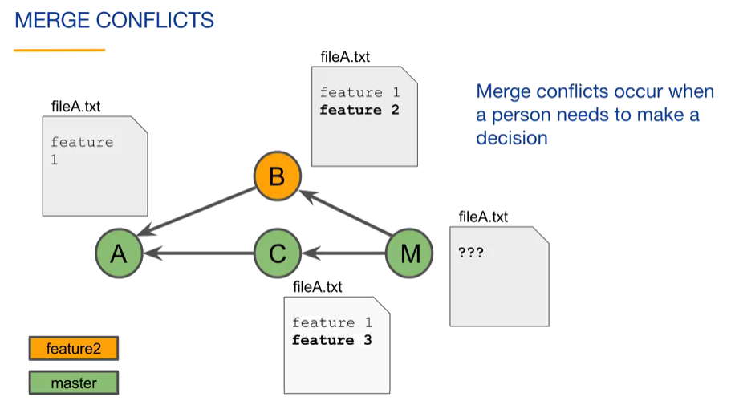

# Branching and Merging II

## Resolving Merge Conflicts

If you perform a merge with a merge commit, Git takes on the responsibility of combining the work of multiple branches and placing the result into a single merge commit. Git will try to do this automatically. However, there are cases where multiple branches make different changes to the same part of a file. In that case, a merge conflict occurs and a person needs to make a decision on [how to resolve it](https://git-scm.com/docs/merge-strategies)



### Notes

Merge conflicts occur when two branches change the same hunk. When changes occur in different parts (hunks) of a file, git manages to automatically merge changes. Basic steps to resolve a merge conflict:

- Checkout master branch
- Merge featureX into the master branch  
    a. CONFLICT: Both modified fileA.txt
- Open FileA.txt and fix the merging problem
- Stage fileA.txt
- Commit the merge commit
- Delete the featureX branch label

Merging conflicts using command line:

```
$ git log --oneline --graph --all
* c1633f9 (HEAD -> master) added feature 3
| * 942b91e (feature2) added feature 2
|/
* c431e4b added feature 1
```

We then try to merge feature2 into the master branch:

```
$ git merge feature2
Auto-merginf fileA.txt
CONFLICT (content): Merge conflict in fileA.txt
Automatic merge failed; fix conflicts and then commit the result.
```
We then check GIT status to see the merging conflict:

```
$ git status
On branch master
You have unmerged paths.
   (fix conflicts and run "git commit")
   (use "git merge --abort" to abort the merge)
Unmerged paths:
   (use "git add <file>..." to mark resolution)
      both modified: fileA.txt
no changes added to commit (use "git add" and/or "git commit -a")
```

Checking the conflicted hunk, we open fileA.txt and see that conflicted hunks are surrounded by conflict markers <<<<<< and >>>>>>

```
feature1
<<<<<< HEAD
feature 3
=========
feature 2
>>>>>> feature2
```

We should then fix fileA.txt in order to avoid conflicts, and then commit the merge.

```
$ git add fileA.txt
$ git commit
(edit merge message if desired)
[master a8899d8] Merge branch 'feature2'
```

Finally, we can check the merge using GIT log;

```
$ git log --oneline --graph --all
* a8899d8 (HEAD -> master) Merge branch 'feature2'
|\
* * 942b91e (feature2) added feature 2
| | c1633f9 added feature 3
|/
* c431e4b added feature 1
```

### Questions

Which one of these statements is true?
- [x] A merge conflict occurs when two branches change the same hunk in different ways.
- [ ] A merge conflict will occur if one branch changes fileA.txt and a second branch changes fileB.txt.
- [ ] A merge conflict occurs with every fast-forward merge.

If a merge conflict occurs, which one of the following statements is true?
- [x] Git modifies file(s) and places them in the working tree.
- [ ] Git creates a merge commit.
- [ ] Git adds file(s) to the staging area.


---
## Tracking Branches

A tracking branch is a local branch that represents a remote branch. Locally, a tracking branch name starts with the remote name, then a forward slash, and then the branch name. If you clone a repository, they'll have a default local tracking branch.


### Notes

Display local and tracking branch names, where `remotes/origin/HEAD` specifies the default remote tracking branch (symbolic reference).

```
$ git branch all
* master
  remotes/origin/HEAD -> origin/master
  remotes/origin/master
```

Checking the commits in our `master` branch:

```
$ git log origin/master --oneline
215b50a (origin/master, origin/HEAD) add feature 1
f92ad48 (HEAD -> master) add fileA.txt

$ git log origin --oneline
215b50a (origin/master, origin/HEAD) add feature 1
f92ad48 (HEAD -> master) add fileA.txt
```

Changing the default remote tracking branch with `git remote set-head <remote> <branch>`

```
$ git branch --all
* develop
  master
  remotes/origin/HEAD -> origin/master
  remotes/origin/develop
  remotes/origin/master

$ git remote set-head origin develop
$ git branch --all
* develop
  master
  remotes/origin/HEAD -> origin/develop
  remotes/origin/develop
  remotes/origin/master
```

### Questions

Which one of the following statements about tracking branches is true?
- [x] A tracking branch is named <remote>/<branch>.
- [ ] A tracking branch is always in synch with its corresponding remote branch.
- [ ] A tracking branch is always in synch with its corresponding local branch.

Which one of the following statements is true?
- [x] When you clone a repository, the default branch is set up as a tracking branch.
- [ ] All local branches automatically have tracking branches.
- [ ] Tracking branches reside only on the remote repository.

Which one of the following statements about tracking branches is true?
- [x] If you create a commit, your local branch will be ahead of the tracking branch.
- [ ] A tracking branch is always in synch with the associated remote branch.
- [ ] A tracking branch is always in synch with the associated local branch.
---
## Fetc

### Notes


### Questions
