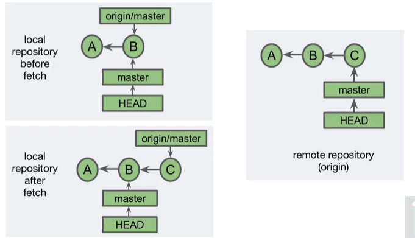
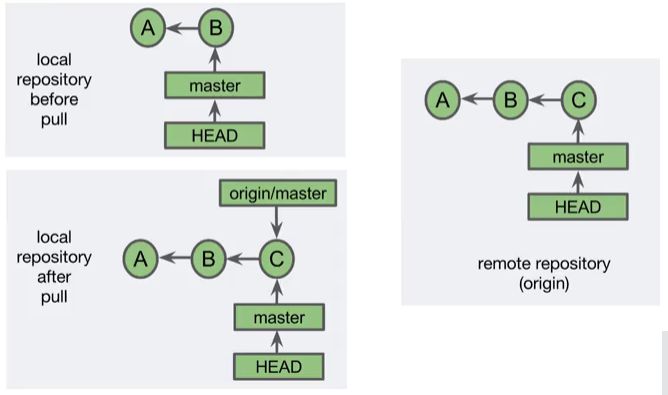
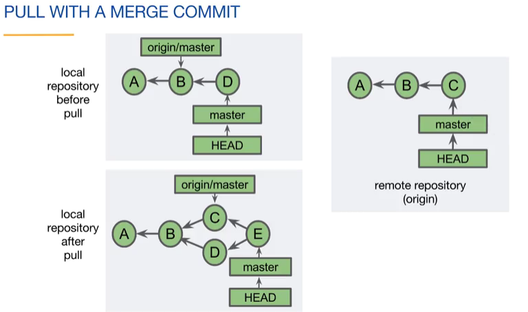
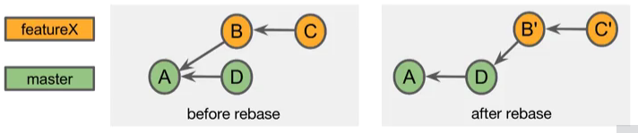
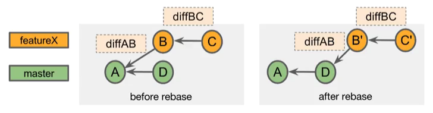

# Branching and Merging II

## Resolving Merge Conflicts

If you perform a merge with a merge commit, Git takes on the responsibility of combining the work of multiple branches and placing the result into a single merge commit. Git will try to do this automatically. However, there are cases where multiple branches make different changes to the same part of a file. In that case, a merge conflict occurs and a person needs to make a decision on [how to resolve it](https://git-scm.com/docs/merge-strategies).


### Notes

Merge conflicts occur when two branches change the same hunk. When changes occur in different parts (hunks) of a file, git manages to automatically merge changes. Basic steps to resolve a merge conflict:

- Checkout master branch
- Merge featureX into the master branch  
    a. CONFLICT: Both modified fileA.txt
- Open FileA.txt and fix the merging problem
- Stage fileA.txt
- Commit the merge commit
- Delete the featureX branch label

Merging conflicts using command line:

```
$ git log --oneline --graph --all
* c1633f9 (HEAD -> master) added feature 3
| * 942b91e (feature2) added feature 2
|/
* c431e4b added feature 1
```

We then try to merge feature2 into the master branch:

```
$ git merge feature2
Auto-merginf fileA.txt
CONFLICT (content): Merge conflict in fileA.txt
Automatic merge failed; fix conflicts and then commit the result.
```
We then check GIT status to see the merging conflict:

```
$ git status
On branch master
You have unmerged paths.
   (fix conflicts and run "git commit")
   (use "git merge --abort" to abort the merge)
Unmerged paths:
   (use "git add <file>..." to mark resolution)
      both modified: fileA.txt
no changes added to commit (use "git add" and/or "git commit -a")
```

Checking the conflicted hunk, we open fileA.txt and see that conflicted hunks are surrounded by conflict markers <<<<<< and >>>>>>

```
feature1
<<<<<< HEAD
feature 3
=========
feature 2
>>>>>> feature2
```

We should then fix fileA.txt in order to avoid conflicts, and then commit the merge.

```
$ git add fileA.txt
$ git commit
(edit merge message if desired)
[master a8899d8] Merge branch 'feature2'
```

Finally, we can check the merge using GIT log;

```
$ git log --oneline --graph --all
* a8899d8 (HEAD -> master) Merge branch 'feature2'
|\
* * 942b91e (feature2) added feature 2
| | c1633f9 added feature 3
|/
* c431e4b added feature 1
```

### Questions

Which one of these statements is true?
- [x] A merge conflict occurs when two branches change the same hunk in different ways.
- [ ] A merge conflict will occur if one branch changes fileA.txt and a second branch changes fileB.txt.
- [ ] A merge conflict occurs with every fast-forward merge.

If a merge conflict occurs, which one of the following statements is true?
- [x] Git modifies file(s) and places them in the working tree.
- [ ] Git creates a merge commit.
- [ ] Git adds file(s) to the staging area.


---
## Tracking Branches

A tracking branch is a local branch that represents a remote branch. Locally, a tracking branch name starts with the remote name, then a forward slash, and then the branch name. If you clone a repository, they'll have a default local tracking branch.


### Notes

Display local and tracking branch names, where `remotes/origin/HEAD` specifies the default remote tracking branch (symbolic reference).

```
$ git branch all
* master
  remotes/origin/HEAD -> origin/master
  remotes/origin/master
```

Checking the commits in our `master` branch:

```
$ git log origin/master --oneline
215b50a (origin/master, origin/HEAD) add feature 1
f92ad48 (HEAD -> master) add fileA.txt

$ git log origin --oneline
215b50a (origin/master, origin/HEAD) add feature 1
f92ad48 (HEAD -> master) add fileA.txt
```

Changing the default remote tracking branch with `git remote set-head <remote> <branch>`

```
$ git branch --all
* develop
  master
  remotes/origin/HEAD -> origin/master
  remotes/origin/develop
  remotes/origin/master

$ git remote set-head origin develop
$ git branch --all
* develop
  master
  remotes/origin/HEAD -> origin/develop
  remotes/origin/develop
  remotes/origin/master
```

### Questions

Which one of the following statements about tracking branches is true?
- [x] A tracking branch is named <remote>/<branch>.
- [ ] A tracking branch is always in synch with its corresponding remote branch.
- [ ] A tracking branch is always in synch with its corresponding local branch.

Which one of the following statements is true?
- [x] When you clone a repository, the default branch is set up as a tracking branch.
- [ ] All local branches automatically have tracking branches.
- [ ] Tracking branches reside only on the remote repository.

Which one of the following statements about tracking branches is true?
- [x] If you create a commit, your local branch will be ahead of the tracking branch.
- [ ] A tracking branch is always in synch with the associated remote branch.
- [ ] A tracking branch is always in synch with the associated local branch.

---
## Fetch, Pull and Push

### Notes

Most commands in Git only interact with the local repository. However, these four commands, which we will call network commands, communicate with the remote repository.

- **Clone**: Copies a remote repository
- **Fetch**: Retrieves new objects and references from the remote repository
- **Pull**: Fetches and merges commits locally
- **Push**: Adds new objects and references to the remote repository

[**Fetch**](https://git-scm.com/docs/git-fetch) retrieves new objects from the remote repository - tracking branches are updated. This allows to check commits and changes in the remote repository without merging them into the local repository. In the figure below, we can see the local repository before fetch and the remote repository containing a commit C not present in the local repository. After fetch, the current status of the remote repository appears in the tracking branch but the master keeps in the last local commit B.



Checking and fetching a repository

```
$ git log origin/master --oneline --graph --all
* 482b095 (HEAD -> master, origin/master) add feature 1

$ git fetch
remote: Counting objects: 3, done.
remote: Compressing objects: 100% (3/3) done.
remote: Total 3 (delta 1), reused 0 (delta 0)
Unpacking objects: 100% (3/3) done.
From https://bitbucket.org/user/repository
   482b095..5ced2f3 master -> origin/master

$ git log origin/master --oneline --graph --all
* 5ced2f3 (origin/master) add feature 2
* 482b095 (HEAD -> master, origin/master) add feature 1
```

GIT status will inform you that your current branch is behind the tracking branch

```
$ git status
On branch master
Your branch is behind 'origin master' by 1 commit, and can be fast-forwarded.
   (use "git pull" to update your local branch)
nothing to commit, working tree clean
```

**Pull**: The pull command combines fetch and merge in one command. If objects are fetched, the tracking branch is merged into the current local branch. This is similar to the topic branch merging in to a base branch. The figure below illustrates the local repository before pull and a remote repository containing a commit ahead of the local repository. After the pull command, the local repository is updated and the head is set to the last commit of the remote repository. 



Running a pull command

```
$ git pull
Updating a65b42..48b095
Fast-forward
   fileA.txt | 2 +-
   1 file changed, 1 insertion(+), 1 deletion(-)
```

GIT pull merging options:

- `--ff` (default): fast-forward if possible, otherwise perform a merge commit
- `--no-ff`: always include a merge commit
- `--ff-only`: cancel instead of doing a merge commit
- `--rebase [--preserve-merges]`: discussed later

In the next figure, we can see when a local repository contains different commits to the remote repository (local contains the commit D and remote contains the commit C. When performing the pull command, the local repository is updated with the information from the remote by first fetching the content of the remote repository and then merging the commit into the local repository, keeping `origin/master` syncronized with the remote repository. 



GIT pull with a fast-forward merge

```
$ git status
On branch master
Your branch is behind 'origin master' by 1 commit, and can be fast-forwarded.
   (use "git pull" to update your local branch)
nothing to commit, working tree clean

$ get pull
Updating 667fd0d..53d1b4b
Fast-forward
   fileA.txt | 1 +-
   1 file changed, 1 insertion(+)

$ git log --oneline
53d1b4d (HEAD -> master, origin/master) added feature 3
667fd0d added feature 2
5d5e128 initial commit
```

### Questions

Which one of these tasks require a connection to another Git repository?
- [x] Cloning a repository.
- [ ] Checking out a different branch.
- [ ] Creating a commit.

Which one of the following statements is true?
- [ ] A fetch may result in a merge conflict.
- [x] A fetch may update your tracking branch.
- [ ] A fetch may update your local branch.

Which one of the following statements about the pull command is true?
- [ ] It fetches objects, then merges the current branch into the tracking branch.
- [ ] It always creates a merge commit.
- [x] It fetches objects, then merges the tracking branch into the current local branch.

Which one of these statements is true?
- [ ] Pushing updates the local branch tip.
- [ ] You must execute a pull before you push.
- [x] Executing a fetch or pull before a push is suggested.

---
## Rebasing

**Warning**: The topics discussed here rewrite the commit history, so this should be done with caution. There's a general rule related to rebase, do not rewrite history that has been shared with others. If you've been working locally, or if you know that no one else has used your branch, you can safely rebase it. 

### Notes

A rebase moves commits to a new parent, or a base. If we look at the example on the left, we have a situation that would typically involve a merge commit, because commit D has been made after the featureX branch was made. However, there is another option, and that is to rebase. What rebasing does is take commit B and C, and moves them to a new parent, commit D. The result is that you no longer need a merge commit, and the merge can be fast-forwarded. Because the commits have been moved, they are reapplied on top of the new commit. This creates a different ancestor chain and, as a result, each of the commit IDs change. So in this example, commit B changes to B prime, and commit C changes to C prime. You can see that this is necessary because before the rebase, commit B's parent was A, and after the rebase, commit B prime's parent is D. 



Types of rebase:

- Regular Rebase
- Interactive Rebase
 
**Diffs**: Each commit contains a snapshot of the complete project. GIT can calculate the difference between commits, also known as a *diff* or a *patch*. When rebasing, GIT applies the diff to the new parent commit -- this is called "reapplying commits".



Rebasing pros and cons:

**Pros:**  
- You can incorporate changes from the parent branch
    * You can use the new features/bugfixes
    * Tests are on more current code
    * It makes the eventual merge into master fast-forwardable
- Avoids "unnecessary" commits
    * It allows you to shape/define clean commit histories

**Cons:**  
- Merge conflicts may need to be solved
- It can cause problems if your commits have been shared
- You are not preserving the commit history

Executing a rebase:  
- Checkout featureX branch
- Rebase onto the tip of the master branch  
    a. CONFLICT: both modified fileA.txt
- Fix fileA.txt
- Add fileA.txt
- Continue rebase

In command line, you can execute `git rebase <upstream> <branch>`, to checkout `<branch>` and changes its parent `<upstream>`:

```
$ git checkout featureX
$ git rebase master

# equivalent to:
$ git rebase master featureX
```
If having a conflict while rebasing:

```
$ git checkout featureX
$ git rebase master
    a. CONFLICT
$ git status
    a. Both modified fileA.txt
# Fix fileA.txt
$ git add fileA.txt
$ git rebase --continue
```

If you want to abort a rebase in case of a conflict, you can run the command `git rebase --abort`.

### Questions

Which one of the following statements is true?
- [ ] Rebasing can not result in a merge conflict.
- [x] Rebasing is a form of merge.
- [ ] Rebasing retains SHA-1 IDs of commits.

Which one of these is a valid way to rebase the commits of a feature branch?
- [ ] Checkout the feature branch. Merge the master branch.
- [x] Checkout the feature branch. Rebase onto the base branch.
- [ ] Checkout the base branch. Rebase onto the feature branch.

After resolving a merge conflict during a rebase, which one of these should you do?
- [x] Continue the rebase.
- [ ] Create a commit.
- [ ] Abort the rebase.


---
## Rewriting History

### Notes

**Ammending a Commit**: You can change the most recent commit by changing the commit message or changing the project files. This creates a new SHA-1 (rewrites history)

```
$ git add fileC.txt
$ git comit -m 'ad fileC.txt'
(master 43f30b5) ad fileC.txt
 1 file changed, 0 insertions(+), 0 deletions(-)
 create mode 100644 fileC.txt

$ git commit --amend -m 'add fileC.txt'
(master d70eb1f) add fileC.txt
 Date: ...
 1 file changed, 0 insertions(+), 0 deletions(-)
 create mode 100644 fileC.txt
```

Updating the content of a file, without changing the message by using `--no-edit`:

```
git log --oneline -l
d70eb1f (HEAD -> master) add fileC.txt
$ echo "some text" > fileC.txt
$ git add fileC.txt
$ git commit --amend --no-edit 
 (master 9cd5d96) add fileC.txt
 Date: ...
 1 file changed, 1 insertion(+)
 create mode 100644 fileC.txt
```

**Interactive Rebase**: It lets you edit multiple commits  
- The commits can belong to any branch
- The commit history is changed- do not use for shared commits
- Commits after the selected commit can be modified

In order to use the interactive rebase, use the `-i` option as `git rebase -i <after-this-commit>`

```
$ git log --oneline --graph
* 2bd5ca3 (HEAD -> master) add fileC.txt
* cf0ffa7 add fileB.txt with typo
* 0e917b6 add fileA.txt

$ git rebase -i 0e91
# <perform changes in files>

$ git add .
$ git commit --amend -m 'add fileB.txt'
(detached HEAD 2a91c04) add fileB.txt
 1 changed, 0 insertions(+), 0 deletions(-)
 create mode 100644 fileB.txt

$ git rebase --continue
Successfully rebased and updated refs/head/master
```

Squash commit: Combine this commit with the older commit, creating a single commit (the work of both commits is included)
Delete commit: No changes from this commit are applied. The diff is thrown out, the work of this commit is lost and there's a greater chance of a merge conflict.

### Questions

Which one of these statements about amending a commit is true?
- [ ] Amending a commit changes its SHA-1 only if you change its commit message.
- [ ] Amending a commit changes its SHA-1 only if you add a file to the commit.
- [x] Amending a commit always changes its SHA-1.

Which one of these statements about interactive rebase is true?
- [x] The children of the specified/selected commit can be modified.
- [ ] Interactive rebase involves at least two branches.
- [ ] Interactive rebase retains the commit history.
