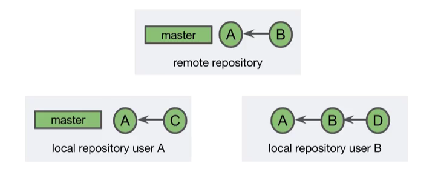
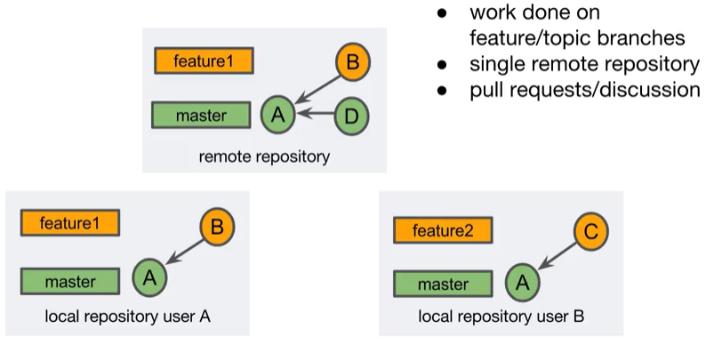
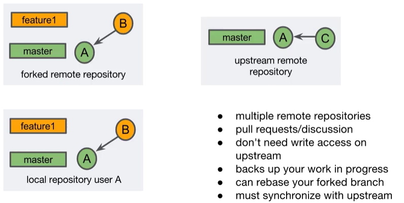
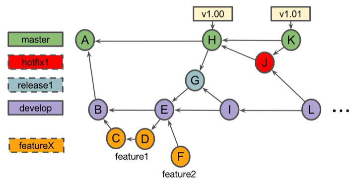

# Git Workflows

## Pull Requests I

### Notes

A feature of Git hosting sites, where the ultimate goal is to merge a branch into the project.  
Two repository configurations:


The first approach is a request to merge a branch of the repository. The second configuration involves two remote repositories. In this configuration, a pull request is a request to merge a branch from a forked repository into the upstream repository. The fork approach is common if the submitter doesn't have write access to the upstream repository. You should open a pull request:

- when the branch is created
- when you want comments on the branch
- when the branch is ready for review/merging

Preparing for a pull request (example):

- Create a feature branch
- Optionally work on the feature branch
- Push the branch to the remote repository

```
$ git checkout -b "featureX"
Switched to a new branch 'featureX'

$ touch fileA.txt
$ git add fileA.txt
$ git commit -m 'added featureX'
[(featureX 52c3153)] added featureX
  1 file changed, 0 inserctions(+), 0 deletions(-)
  create mode 100644 fileA.txt
$ git push --set-upstream origin featureX
(snip)
remote: Create pull request for featureX:
remote:  https://bitbucket.org/user/repoX/pull-request/new?source=featureX&t=1
To https://bitbucket.org/user/repoX.git
  * [new branch]  featureX -> featureX
Branch featureX set up to track remote branch featureX from origin
```

After the merge, you can delete the remote branch labels

```
$ git push -d origin featureX
To https://bitbucket.org/user/repoX.git
  - [deleted]  featureX
```

### Questions

Which one of these statements is true?
- [ ] Pull requests are a request to pull content from a remote repository.
- [x] Pull requests enable team discussion of work on a branch.
- [ ] Pull requests should only be opened when you are ready to merge a branch.

Which one of these statements about single repository pull requests is true?
- [x] You can edit the pull request after opening it.
- [ ] The branch does not need to be on the remote repository.
- [ ] You must create a new pull request if you add a commit after creating the pull request.


---
## Pull Requests II

### Notes

**Forking** means copying a remote repository to your own online account, where both repositories are remote repositories. It is interesting to perform a fork when you want to want to experiment or learn from the *upstream* repository. The *upstream* repository is usually the "source of truth". A fork can be used to issue pull requests to the *upstream* repository as well as create a different source of truth, when developing a new line of development of the project and remains independent from the *upstream* repository. Syncronizing a fork creates a merge commit on the forked repository. 

### Questions

Which one of these statements is true?
- [ ] A clone and a fork are the same thing.
- [x] A fork is a remote repository.
- [ ] A fork is the project's source of truth.

After synchronizing a fork, what should you do to update a local repository related to the fork?
- [ ] Push changes to the fork.
- [x] Fetch or pull changes from the fork.
- [ ] Create a merge commit.

Which of the following statements is true?
- [x] Merging a multi-repository pull request involves a fork.
- [ ] You must use a local Git client to merge a multi-repository pull request.
- [ ] A multi-repository pull request is made from a local repository.

---
## Git Workflow

### Notes

**Centrilized workflow** uses a single branch to accomplish the work of the project. Even though this workflow is very simple, you still gain many of the benefits of git. Your team members can all work independently, and each has a local copy of the project history. As illustrated in the figure below, the remote repository contains two commits. User A cloned, fetched, or pulled when the remote repository only had commit A. They then created commit C. To add commit C to the remote repository, this user would have to pull or fetch and merge before pushing commit C. User B currently has both commits from the remote repository and would be able to push to the remote repository with no problem. A down side of the centralized workflow is that you are not taking advantage of features related to branching, such as pull requests. 



**Feature branch workflow** is used when the work of the project is done in feature, or topic branches. The work is then merged into a longer running branch. This has been the workflow used throughout most of this course. The feature branch workflow uses a single remote repository. Team members create feature branches and can submit their work using pull requests. 



**Forking workflow** uses multiple repositories, where one of the repositories is considered upstream from the other. The upstream repository is considered the source of truth for the project. Work is usually transferred from the remote repository to the upstream repository, via a pull request. One advantage of this workflow is that the user of the forked repository does not need to have right access to the upstream repository. This is because a user on the upstream repository merges the pull request. Because of this, the forking workflow is very common in open source projects. Forking a repository is a great way to work on a feature branch without sharing your branch. This provides a remote backup of your work, and allows you to safely rebase your local branch. A downside of this approach is that the two remote repositories can become out of sync. It's the responsibility of the forked repository to keep up to date with the upstream repository. 



**Gitflow workflow** allows safe continuous releases of the project. It allows work to continue even through releases and hotfixes. This commit graph is an example in the spirit of a GitFlow workflow. The general ideas here are used in specific ways that depend on the team and the type of project, involving a number of branches. In the diagram below, the long running branch labels have solid borders and the short lived branch labels have dashed borders. You can see that the master and developed branches are the only long running branches. If you look at the master branch, you can see that there are three commits. Commit A is the initial commit in the repository. We will assume that any commits on the master branch after commit A represent a version of our project that customers can use. These releases have been tagged with version labels. This commit graph includes a release of version1 of the project, then shortly follows with a minor update. We are going to keep things simple and release version 1 of the project with a single feature named feature1. 



The initial commit of the project is created on the master branch. It can be very simple, like a read me file. The develop branch is created off of the master branch. Commit B is the first commit on the develop branch. It too can be very simple. We have now created our two long running branches. Our first release of the project is planned to have only a single feature named feature1. We create a feature1 branch, then get to work. Commit C begins the work of feature1. We then finish the work of feature1 in commit D. Let's assume that the team decides that feature1 is ready to be merged into the developed branch. This may have been done through a pull request. Merge commit E is created on the develop branch. At this point, the develop branch contains feature1. Since the feature1 branch is merged, we can delete the feature1 branch label. 

The team has decided that the first release will contain only a single feature, and that commit E represents a release candidate. A release1 branch is created off of commit E. At this point, commits intended for release1 can only be made on the release1 branch. Any commits to the develop branch will be in a future release. The commits on the release1 branch should mainly be for fixing issues with release1, not adding new features. Since the developer is done with feature1 and knows of no issues with the release, they create a feature2 branch and begin working on feature2. This work is for a later release of the project. Commit F contains some of the work of feature2. The team has discovered a bug in Commit E. Commit G is added to the release1 branch. This commit fixes the bug. As far as the team is concerned, commit G is ready for release to the master branch. 

Merge commit H is created. This contains feature1. Commit H is tagged with a version 1.0 label so that team members can easily find released versions of the project. When you commit to the master branch in a GitFlow workflow, it's important to consider how that commit impacts other branches. Commit G should be merged into the develop branch, which we do here with commit I. If we didn't do this, the bug fix from commit G would not be in the develop branch. This means that the bug would come back in the next release. Because we have merged the release1 branch to both master and develop, we can now delete the branch1 label. Release branches are only valid for a single release. Let's say that we are working away on feature2, and then then someone reports a bug with our version 1 release. We create a hotfix1 branch to deal with this problem. And create commit J which fixes the bug. We do not branch off of the develop branch because new commits could have been made to the develop branch for the next release. We don't want those features in our hotfix. We want to make the change to the release as small as we can to limit our risk while still fixing the bug. 

Hotfix commit J is then merged into master with commit K. This fixes the bug. We tag commit K with version 1.01. This represents the latest release of the project. Because we have committed to master, we need to also commit to the develop branch. Merge commit L is then created and sharing that the hotfix is also included in the develop branch. A hotfix branch is created for a single hotfix and once changes are merged to the master and developed branches, the hotfix1 branch label can be deleted. At this point, we can continue work on feature2 and any other work planned for the next release. 

### Questions

Which one of these is a disadvantage of a workflow using only the master branch?
- [x] No pull requests.
- [ ] No local repositories.
- [ ] No merging.

Which one of the following statements about feature branch workflows is true?
- [ ] Merging is not allowed.
- [ ] They typically involve forking a repository.
- [x] The work of the project is done on feature branches.

Which one of the following statements about forking workflows is true?
- [ ] The remote repositories are always synchronized.
- [x] A person making a pull request does not need write access to the upstream repository.
- [ ] Rebasing is not allowed.

Which one of the following statements about Gitflow workflows is true?
- [ ] All branches are short-lived branches.
- [ ] All branches are long-running branches.
- [x] There are different types of branches.
---

