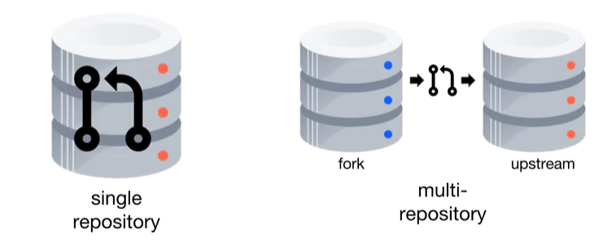

# Git Workflows

## Pull Requests I

### Notes

A feature of Git hosting sites, where the ultimate goal is to merge a branch into the project.  
Two repository configurations:



The first approach is a request to merge a branch of the repository. The second configuration involves two remote repositories. In this configuration, a pull request is a request to merge a branch from a forked repository into the upstream repository. The fork approach is common if the submitter doesn't have write access to the upstream repository. You should open a pull request:

- when the branch is created
- when you want comments on the branch
- when the branch is ready for review/merging

Preparing for a pull request (example):

- Create a feature branch
- Optionally work on the feature branch
- Push the branch to the remote repository

```
$ git checkout -b "featureX"
Switched to a new branch 'featureX'

$ touch fileA.txt
$ git add fileA.txt
$ git commit -m 'added featureX'
[(featureX 52c3153)] added featureX
  1 file changed, 0 inserctions(+), 0 deletions(-)
  create mode 100644 fileA.txt
$ git push --set-upstream origin featureX
(snip)
remote: Create pull request for featureX:
remote:  https://bitbucket.org/user/repoX/pull-request/new?source=featureX&t=1
To https://bitbucket.org/user/repoX.git
  * [new branch]  featureX -> featureX
Branch featureX set up to track remote branch featureX from origin
```

After the merge, you can delete the remote branch labels

```
$ git push -d origin featureX
To https://bitbucket.org/user/repoX.git
  - [deleted]  featureX
```


### Questions

Which one of these statements is true?
- [ ] Pull requests are a request to pull content from a remote repository.
- [x] Pull requests enable team discussion of work on a branch.
- [ ] Pull requests should only be opened when you are ready to merge a branch.

Which one of these statements about single repository pull requests is true?
- [x] You can edit the pull request after opening it.
- [ ] The branch does not need to be on the remote repository.
- [ ] You must create a new pull request if you add a commit after creating the pull request.


---
## Pull Requests II


### Notes


### Questions

- [ ] 


---
## Git Workflow


### Notes


### Questions

- [ ] 


---

