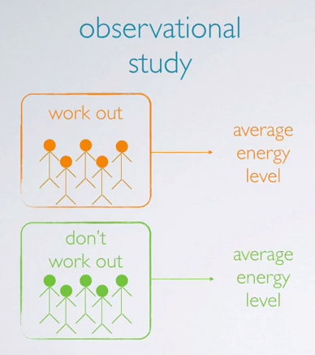
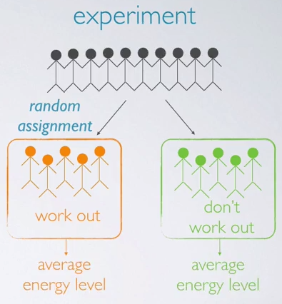
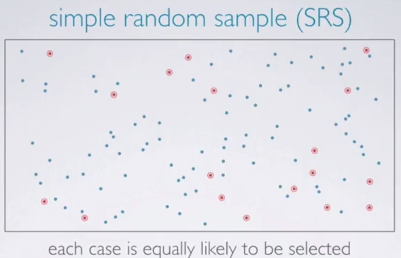
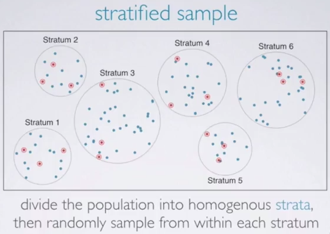
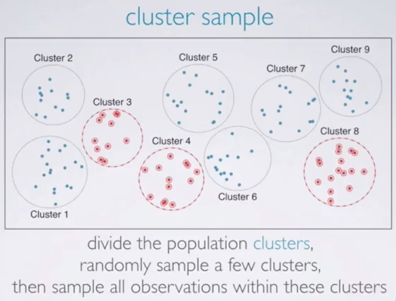
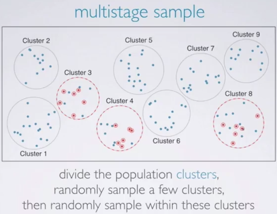
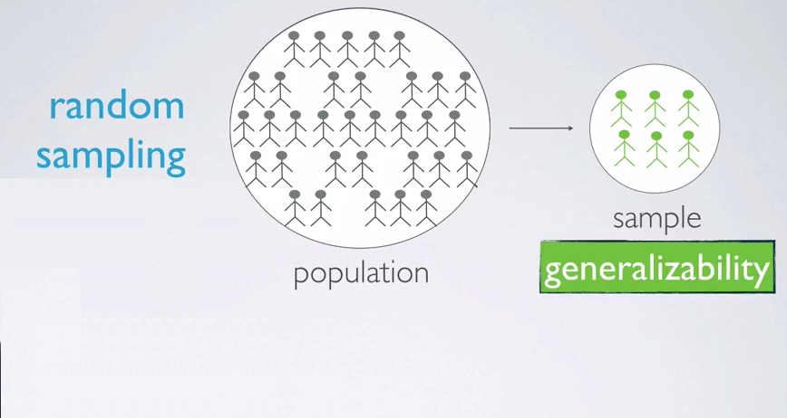
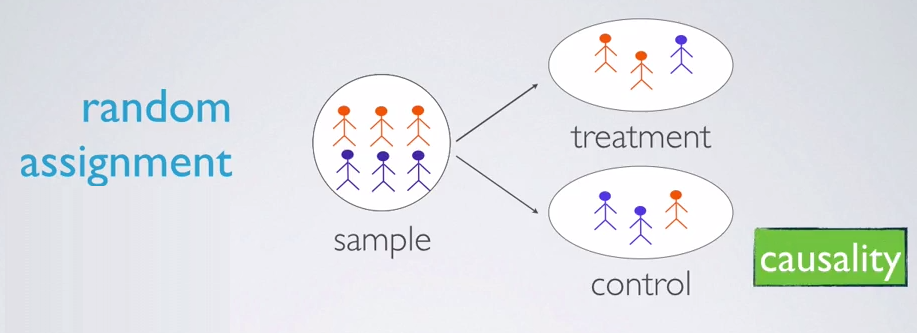

# Designing Studies

---
## Data Basics

**Types of variables**
- Numerical: (quantitative) take on numerical values sensible to add, subtract, take averages, etc. with these values
- Categorical: (qualitative) take on a limited number of distinct categories. Categories can be identified with numbers, but not sensible to do arithmetic operations

**Numerical variables**
- Continuous: Take on any of an infinite number of values within a given range
- Discrete: Take on one of a specific set of numeric values

**Categorical variables**
- Regular categorical:
- Ordinal: Levels have an inherent ordering

Two variables that show some connection with one another are called *associated* (*dependent*). Association can be further described as *positive* or *negative*. If two variables are not associated, they are said to be *independent*.

### Questions:

Which type of variable is ud_req (number of user data requests as part of a criminal investigation)?
- [ ] numerical, continuous
- [x] numerical, discrete
- [ ] categorical
- [ ] categorical, ordinal

Which type of variable is hdi (Human Development Index, combining factors of life expectancy, educational attainment, and income) with levels very high, high, medium, and low human development)?
- [ ] numerical, continuous
- [ ] numerical, discrete
- [ ] categorical
- [x] categorical, ordinal

---
## Observational Studies & Experiments

**Types of Studies**
- Observational: Collect data in a way that does not directly interfere with how the data arise ("observe"). It only stablishes an association. In other words, correlation between the explanatory and the response variables. If an observational study uses data from the past, it's called a *retrospective* study. Whereas if data are collected throughout the study, it's called *prospective*.
- Experiment: Randomly assign subjects to treatments. It establishes causal connections.

In an observational study, we sampled two types of people from the population. Those who choose to work out and those who don't, then find the average energy level for the two groups of people and compare. 

On the other hand, in an experiment, we sample a group of people from the population, then we randomly assign these people into two groups. Those who will regularly work out through the course of the stud and those who will not. The difference is that the decision of whether to work out or not is not left up to the subjects as in the observational study, but is instead imposed by the researcher. At the end, we compare the average energy levels of the two groups based on the observational study even if we find the difference between the average energy levels of these two groups of people, we can't attribute this difference solely to working out. Because there may be other variables that we didn't control for in this study, that contribute to the observed difference. For example, people who are in better shape might be more likely to regularly work out and also have higher energy levels. However, in the experiment, such variables that might also contribute to the outcome are likely equally represented in the two groups due to the random assignment. Therefore, if we find a difference between the two averages, we can indeed make a colossal statement attributing this difference to working out.

### Questions:

What type of a study is this?
- [ ] experiment
- [x] observational study

What is the main difference between observational studies and experiments?
- [ ] Experiments take place in a lab while observational studies do not need to.
- [ ] In an observational study we only look at what happened in the past.
- [x] Most experiments use random assignment while observational studies do not.
- [ ] Observational studies are completely useless since no causal inference can be made based on their findings.

---
## Sampling and Source of Bias

**Sources of sampling bias**
- Convenience sample bias: It occurs when individuals who are easily accessible, are more likely to be included in the sample. For example, say you want to find out how people in your city feel about a recent increase in public transportation costs. If you only poll people in your neighborhood, as opposed to a representative sample from the whole city, tour study would suffer from convenience bias.
- Non-response: It happens if only a non-random fraction of the randomly sampled people respond to a survey, such that the sample is no longer representative of the population. For example, say you take a random sample of individuals from your city, and attempt to survey them, but certain segments of the population, say those from a lower socioeconomic status, are less likely to respond to the survey. 
- Voluntary response bias: It occurs when the sample consists of only people who volunteer to respond because they have strong opinions on the issue. For example, say you place polling machines at all bus stops and metro stations in your city, but only those who choose to do so actually take the time to vote and express their opinion on the recent increase on public transportation costs. 

**Sampling Methods**
- Simple random sampling: we randomly select cases from the population, such that each case is equally likely to be selected. This is similar to randomly drawing names from a hat. 

- Stratified sampling: we first divide the population into homogenous groups called strata, and then randomly sample from within each stratum. For example, if we wanted to make sure both genders are equally represented in a study, we might divide the population first into males and females, and then randomly sample from within each group.

- Cluster sampling: we divide the population into clusters, randomly sample a few clusters, and then sample all observation within these clusters. The clusters, unlike strata and stratified sampling, are heterogeneous within themselves, and each cluster is similar to another, such that we can get away with just sampling from a few of the clusters. 

- Multistage sampling: we divide the population into clusters, randomly sample a few clusters, and then we randomly sample observations from within these clusters. Usually, we use cluster sampling and multistage sampling for economical reasons. For example, one might divide a city into geographic regions that are on average similar to each other, and then sample randomly a few of these regions, go to these randomly picked regions, and then, sample a few people from within these regions. This avoids the need to travel to all of the regions in the city. 

### Questions:

A retail store considering updates to their credit card policies randomly samples 1000 of their credit card holders to survey on the phone. The phone calls are made during business hours, therefore there is a lower rate of responses from members who work during these hours. What type of bias is this indicative of?
- [ ] Convenience sample
- [ ] Voluntary response
- [x] Non-response
- [ ] None of the above

A city council has requested a household survey be conducted in a suburban area of their city. The area is broken into many distinct and unique neighborhoods, some including large homes, some with only apartments. Which approach would likely be the least effective?
- [ ] Stratified sampling, where each stratum is a neighborhood
- [x] Cluster sampling, where each cluster is a neighborhood
- [ ] Simple random sampling

---
## Experimental Design

**Principles of experimental design**
- Control: It means to compare treatment of interest to a control group
- Randomize: It means randomly assigning subjects to treatments
- Replicate: It means collecting a sufficiently large sample within the study or to replicate the entire study
- Block: If there are variables that are know or suspected to effect the response variable, first group the subjects into blocks based on these variables. And then randomized cases with in each block to treatment groups. 

For example, we would like to design and experiment to investigate if energy gels make you run faster. The treatment group gets the energy gel, the control group does not get any energy gel. It is suspected that energy gels might effect pro and amateur athletes differently therefore we block for pro status. To do so, we divide our sample into pro and amateur athletes, and then, we randomly assign pro and amateur athletes to treatment and control groups, therefore, pro and amateur athletes are equally represented in the resulting treatment and control groups. This way, if we do find a difference in running speed between the treatment and control groups we will be able to attribute it to the treatment, the energy gel, and can be assured that the difference isn't due to pro status since both pro and amateur athletes were equally represented in the treatment and control groups.

**Blocking vs. Explanatory variables**
- Explanatory variables (factors) - conditions we can impose on experimental units
- Blocking variables - characteristics that the experimental units come with, that we would like to control for

**Experimental Terminology**
- *Placebo* is fake treatment, often used as the control group for medical studies 
- *Placebo effect* is when experimental unit show improvement simply because they believe they're receiving a special treatment
- *Blinding* is when experimental units do not know whether they are in the control or the treatment groups
- *Double-blind study* is one where both the experimental units and the researchers do not know who is in the control and who is in the treatment group 

### Questions:

A study is designed to test the effect of light level and noise level on exam performance of students. The researcher also believes that light and noise levels might have different effects on males and females, so wants to make sure both genders are represented equally under different conditions. Which of the below is correct?
- [ ] There are 3 explanatory variables (light, noise, gender) and 1 response variable (exam performance)
- [ ] There is 1 explanatory variable (gender) and 3 response variables (light, noise, exam performance)
- [ ] There are 2 blocking variables (light and noise), 1 explanatory variable (gender), and 1 response variable (exam performance)
- [x] There are 2 explanatory variables (light and noise), 1 blocking variable (gender), and 1 response variable (exam performance)

*The researchers are interested in the effect of light and noise on exam performance. Since they believe these two variables might be affecting the outcome, these are the explanatory variables and exam performance is the response variable. Gender of the student is a nuisance variable they want to control for, hence they block for it. Unlike light and noise, gender is not a treatment that is being imposed on the subjects.*

---
## Random Sample Assignment

*Random sampling* occurs when subjects are being selected for a study. If subjects are selected randomly from the population, then each subject in the population is equally likely to be selected, and the resulting sample is likely representative of the population. Therefore the study's results are generalizable to the population at large. 

*Random assignment* occurs only in experimental settings, where subjects are being assigned to various treatments. Taking a close look at our sample, we usually see that the subjects exhibit slightly different characteristics from one another. Through a random assignment, we ensure that these different characteristics are represented equally in the treatment and control groups. This allows us to attribute any observed difference between the treatment and control groups, to the treatment being observed on the subjects, since otherwise these groups are essentially the same. In other words, random assignment allows us to make causal conclusions based on the study. 

To wrap up:

