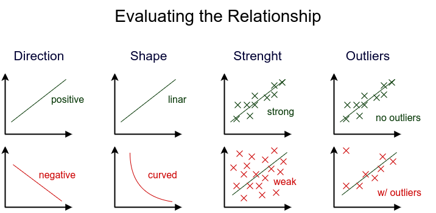
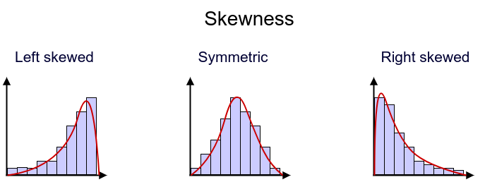
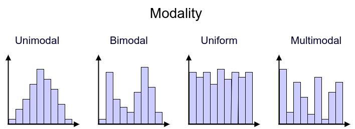
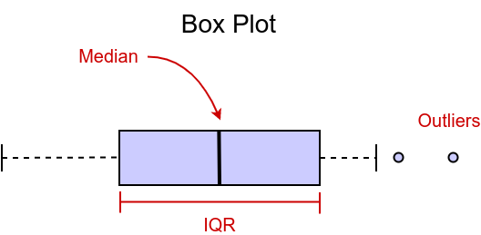
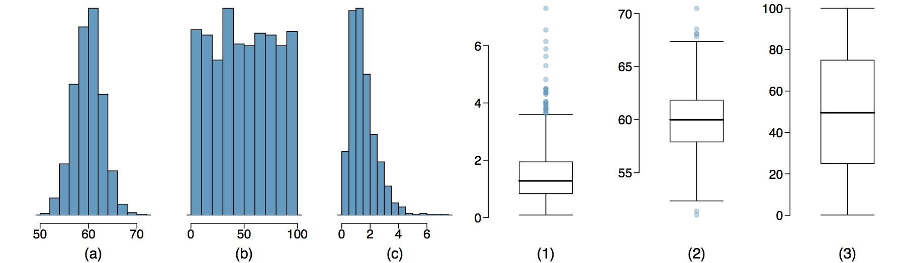
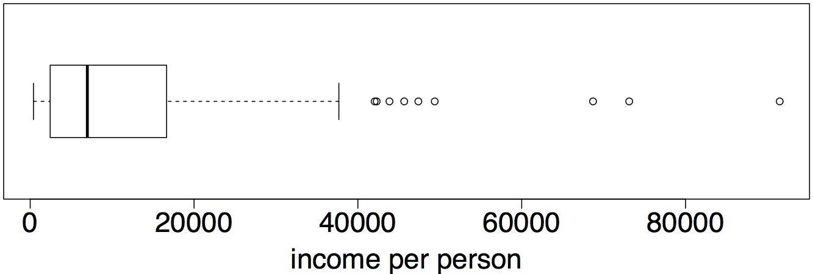

# Exploring Numerical Data

## Visualizing Numerical Data

- Evaluating the relationship

When evaluating the relationship between two numerical variables, we should make sure to examine the direction of the relationship. Is it increasing, or decreasing. The shape of the relationship, i.e., is it linear, or does it follow some other form? The strength of the relationship. Is the relationship strong? Indicated by little scatter. Or weak, indicated by lots of scatter. And any potential outliers.  These can be individual observations or a group of observations. It's always a good idea to investigate these points carefully to make sure they're not data entry errors. 

- Histogram

In a histogram, data are binned into intervals and height of the bars represent the number of cases that fall into each interval. It provides a view of the data density and it is especially useful for describing the shape of the distribution. For example, in this case the distribution of life expectancies appear to be left skewed which is expected due to the leveling off of life expectancies. There's a physiological limit to how long people live. And in most countries, people live up to that time but there are some countries with much lower life expectancies and fewer and fewer of these countries with lower and lower expectancies. Resulting in a long left tail. 

Another example is the distribution of income, which is right skewed. Incomes can't be negative so we have a natural boundary at zero, but there is no real upper limit to how high incomes can go. However, as we go higher and higher we have fewer and fewer countries with such high levels of personal income resulting in a long right tail.

- Skewness

Distributions are set to be skewed to the left side of the long tail. In a left skewed distribution, the longer tail is on the left on the negative end. If no skewness is apparent, then the distribution is said to be symmetric. And in a right skewed distribution, the longer tail is on the right, the positive end. As you can see, the best way to assess the shape of distributions is to step back and imagine a smooth curve outlining the distribution, instead of focusing on the jagged edges of the bars in the histogram. 

- Modality

A distribution might be unimodal with one prominent peak, bimodal with two prominent peaks, or uniform with no prominent peaks. With more than two prominent peaks a distribution is usually said to be multimodal. The distribution that you will most closely work with is unimodal, the normal distribution, that you may also know as the bell curve. A bimodal distribution might indicate that there are two distinct groups in your data. A uniformed distribution means there's no apparent trend in the data. That high and low values of the variable are equally likely to occur. 

- Visualization using Box plot

A box plot also readily displace the median. The mid point of the distribution, this is the thick line inside the box, and the interquartile range, the width of the box. Outliers are represented with circles in this visualization. 

### Questions

1. Which of these variables do you expect to be uniformly distributed?
- [ ] weights of adult females
- [ ] salaries of a random sample of people from Europe
- [ ] housing prices in a large city
- [x] birthdays of people living in your neighborhood (day of the month)

2. Which of the following cannot be determined from a boxplot?
- [x] modality (whether the distribution is unimodal, bimodal, uniform, etc.)
- [ ] skewness
- [ ] outliers
- [ ] minimum and maximum

3. Determine which histogram matches which box plot.

- [x] A - 2, B - 3, C - 1
- [ ] A - 1, B - 2, C - 3
- [ ] A - 1, B - 3, C - 2
- [ ] A - 2, B - 1, C - 3
- [ ] A - 3, B - 1, C - 2

## Measures of Center

A key characteristic of interest is the center of the distribution, commonly used measures of center are the **mean**, which is simply the arithmetic average. The **median**, which is the mid point of the distribution or in other words the 50th percentile and the **mode** which is the most frequent observation. 

For example, suppose we have exam scores from 9 students. 

$
75, 69, 88, 93, 95, 54, 87, 88, 27
$

The mean of this distribution is simply the arithmetic average of these scores.

$
mean = \frac{75+69+88+93+95+54+87+88+27}{9} = 75.11
$

The mode is the most frequently observed value. In this case, we have two students who scored 88, so the mode is 88. However, we can see that with continuous distributions, it may be very unlikely to observe the same exact value multiple times. Therefore, the mode of a distribution is not always a very useful measure. 

The median is defined as the midpoint or the 50th percentile of the distribution. In order to calculate the median, we need to first sort the data in increasing order. The we find the mid-point of the ordered data which in this case happens to be 87. 

$
median: 27, 54, 69, 75, **87**, 88, 88, 93, 95
$

But what if we didn't have an exact midpoint of the distribution? Say we have one more student who scored 100. 

$
27, 54, 69, 75, 87, 88, 88, 93, 95, 100
$

Now the sample size is 10 and with an even number of observations there isn't a simple value that divides the data in half. In these cases, the median as defined as the average of the middle of the two observations. Here, we have 87 and 88 at the middle of our distribution so the median based on this new data set would be 87.5. 

$
median: 27, 54, 69, 75, **87**, **88**, 88, 93, 95, 100 = \frac{87+88}{2} = 87.5
$

### Questions

1. Which of the following is true? (Hint: Sketching the distributions might be useful.)
- [ ] In a symmetric distribution, more than 50% of the data are below and less than 50% are above the mean.
- [ ] In a left skewed distribution, roughly 50% of the data are below and 50% are above the mean.
- [ ] In a right skewed distribution, less than 50% of the data are below the mean.
- [x] In a left skewed distribution, less than 50% of the data are below the mean.

## Measures of Spread

Measures of spread are statistics that tell us about the variability in the data. Some measures of spread are:

- **Range**, which is represented by the difference between the maximum and the minimum values in the data. This measure is not a very reliable measure of variability of the sample, since it depends on the two most extreme values, the end points of the distribution. 

$
range: (max-min)

- **Variance** is the average squared deviation from the mean. It is denoted as *s* squared ($s^2$), and population variance as *Sigma* squared ($\sigma^2$). To calculate the variance, we first find the difference between the mean for each observation. We square each of these deviations and add them up, for all observations in the data set. Then we find the average square deviation, by dividing the sum by the sample size *n-1*.

$
s^2 = \frac{\sum^{n}_{i=1} (x_i - \bar{x})^2}{n-1}
$

For example, given that the average life expectancy is 70.5 and there are 201 countries in the data set, we can calculate the variance as: 

|     |   Country   | Life exp |
| :-: | :---------: | :------: |
|   1 | Afghanistan |   60.3   |
|   2 | Albania     |   77.2   |
|   3 | Algeria     |   70.9   |
|     | ...         |   ...    |
| 201 | Zimbabwe    |   58.1   |

$ 
s^2 = \frac{(60.3 - 70.5)^2 + (77.2 - 70.5)^ + \cdots + (58.1 - 70.5)^2}{201-1}
s^2 = 83.06 years^2
$

The units of the variance, is the square of the units of the original data, since we squared the deviations from the mean in calculation of the variance. This is actually somewhat annoying, since the result, 83.06 years squared, is not very meaningful. We square the differences in the calculation of the variance because it allows us to get rid of negatives. It also increases larger deviations more than smaller ones. This way, larger deviations are weighed more heavily. 

- **Standard deviation** is basically the average deviation around the mean. Calculated as the square root, of the variance. It is represented as $s$ for the sample standard deviation and $\sigma$ for the population standard deviation.

$
\sigma = \sqrt{s^2}
$

Understanding variability, is essential for doing statistics. A concept that's often confused it with variability is diversity. 

Which of the following sets of cars has more variable mileage? Set 1 with cars with 10, 20, 30, 40, and 50 miles per gallon. Or, Set 2 with 3 cars that get 10 miles per gallon, and 2 cars that get 50 miles per gallon. For the first set we have:

$
mean_1 = \frac{10+20+30+40+50}{5} = 30
s^2_1 = \frac{(10-30)^2 + (20-30)^2 + (30-30)^2 + (40-30)^2 + (50-30)^2}{5-1}
s^2_1 = \frac{1000}{4} = 250
\sigma_1 = \sqrt{s^2_1} = \sqrt{250} = 15.81
$

Thus, having a standard deviation of 15.81 miles per gallon. For the second set we have:

mean_2 = \frac{10+10+10+50+50}{5} = 26
s^2_1 = \frac{(10-26)^2 + (10-26)^2 + (10-26)^2 + (50-26)^2 + (50-26)^2}{5-1}
s^2_1 = \frac{1920}{4} = 480
\sigma_1 = \sqrt{s^2_1} = \sqrt{480} = 21.90
$

Having a standard deviation of 21.90 miles per gallon.

- **Inter-Quartile Range (IQR)** is the range of the middle 50% of the data. It can be calculated as the difference between the first quartile (25th percentile) and the third quartiles (75th percentile).

$
IQR = Q3 - Q1
$

This measure, is most readily available in a box plot. 

In this box plot, the first quartile Q1 is 65, and the third quartile is 77. So the IQR is the difference between these two, 12. In describing the distribution of life expectancies, we can say that the middle 50% of countries, have life expectancies between 65 and 77 years old. The value of the IQR itself, 12, isn't as informative on its own, but would be useful when comparing distributions. The reason why the IQR is a more reliable measure of spread in sample data than the range, which is maximum minus minimum, is that it doesn't rely on the endpoints. Which may be unusual observations or potential outliers. 

### Questions

1. Given that the variance of life expectancies was 83.06 squared years, which of the following is the correct standard deviation and units?
- [ ] $\sqrt{83.06} = 9.1$ squared years
- [x] $\sqrt{83.06} = 9.1$ years
- [ ] $83.06^{2} = 6899$ years
- [ ] $83.06^{2} = 6899$ squared years
- [ ] $\frac{83.06}{(201 - 1)} = 0.4153$ years 

2. Which of the following sets of cars, has more diverse composition of colors? SET 1 with yellow, red, green, purple and blue colors or, SET 2 with three blue and two purple cars.
- [x] Set 1 (yellow, red, green, purple, blue)
- [ ] Set 2 (three blue, two purple)

3. Which of the following sets of cars has more variable mileage? Set 1 with cars with 10, 20, 30, 40, and 50 miles per gallon. Or, Set 2 with 3 cars that get 10 miles per gallon, and 2 cars that get 50 miles per gallon.
- [ ] Set 1 (10, 20, 30, 40, and 50 miles per gallon)
- [x] Set 2 (three 10, and two 50 miles per gallon)

4. Which of the following is false about the distribution of income per person in countries? 

Min. = $403, Q1 = $2438, Median = $6975, Q3 = $16650, Max. = $91490.

- [ ] 25% of the countries have incomes per person below $2438.
- [x] 75% of the countries have incomes per person above $16650.
- [ ] IQR is 14212.
- [ ] The mean is expected to be greater than the median since the distribution is right skewed.
