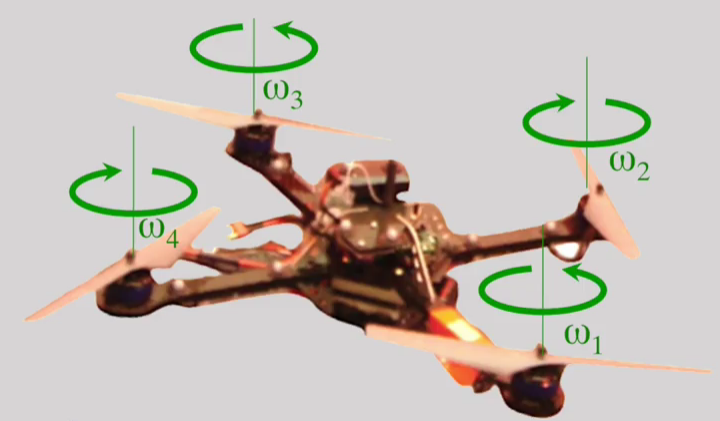
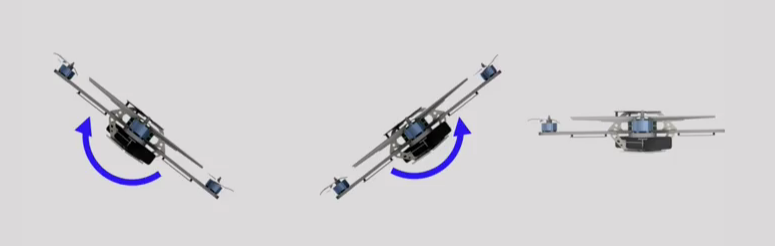
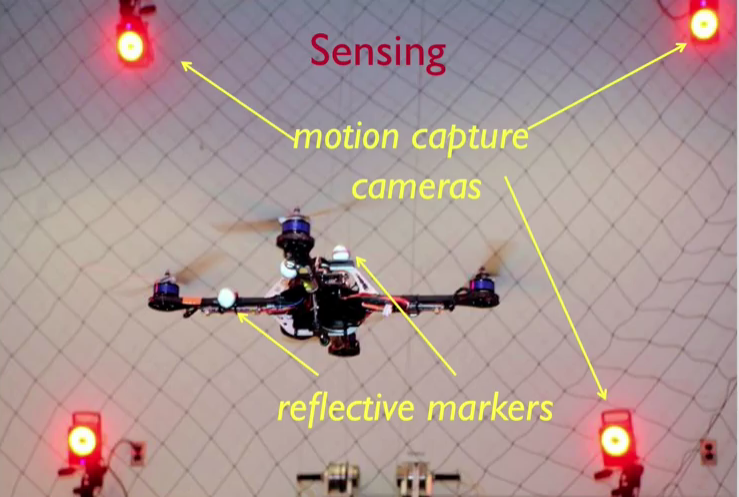
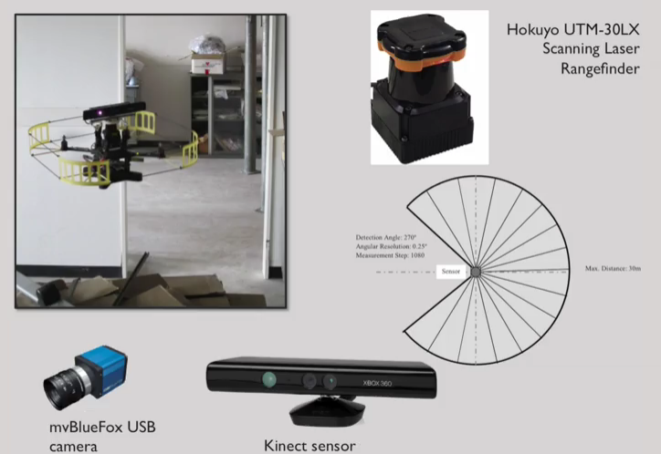

# Introduction

## Notes

In the quadrotor, you'll find that if you look at rotors 1 and 3. And rotor 2 and 4, they're pitched in opposite directions. So in fact, if you look at the arrows denoting the directions of rotation. Omega 1 and omega 3 are positive counterclockwise, when viewed from the top. While omega 2 and omega 4 are positive counterclockwise, when viewed from the bottom. If you vary the speeds of these independent motors, the rotors, you'll be able to control the position and orientation of the robot. 

 If you take one of the rotors and spin that rotor faster, you will cause the robot to pitch in one direction. If you spin the other rotor faster, you're gonna have its pitch or roll in the other direction. One question you should ask yourself is how do you get the robot to steer or to yaw? What you really have to do is to pitch the robot forward so that the trust factor points in the horizontal direction. That allows the vehicle to accelerate forward. But then when you get close to the destination, you want to stop the vehicle. And for that, you have to pitch it in the opposite direction, creating a reverse thrust that allows it slow down when it gets to its destination. And then you have to pitch it back to equilibrium. 

Key components:
---------------

- State estimation: estimate the position and velocity (including rotation and angular velocity of the robot)
- Control: Command motors and produce desired actions in order to navigate to desired state
- Mapping: The vehicle must have some capability to map the environment
- Planning: Given a set of obtacles, the vehicle must have the capability to plan a path to avoid the obstacles and reach the goal
 

State Estimation:
-----------------

Obtain reliable estimates of position and velocity. 

So in the lab, we have motion capture cameras that allow the robot to measure its position. What essentially happens is through the reflective markers that are mounted on the robot, the cameras can estimate the position of each reflective marker and these cameras can do it at split second timing exceeding speeds of 100 times a second to 200 times a second. Also, these measurements are incredibly precise. The accuracies can be well below one millimeter. 

If you go outdoors, in general you might not have GPS, or your estimates of position from GPS can be very inaccurate. This is especially true next in extra tall buildings. Certainly when you go indoors, it's hard to get GPS. And we'd like to be able to operate both indoors and outdoors. There's no GPS and because these vehicles are small and maneuverable, they can find themselves in settings where it's very difficult to communicate directly with the vehicle. In such cases, imagine that the vehicle is equipped with sensors such as cameras or color plus depth cameras as you see on the bottom, or laser range finders as you see on the top right. These sensors allow the vehicles to infer information about the environment, and from this information allow it to localize itself. 

## Questions

Which factors have contributed to the rapidly-increasing commercial interest in Unmanned Aerial Vehicles? Select all that apply.
- [x] Increased performance to price ratio of processors
- [x] Open source software
- [x] Access to GPS signals
- [x] Better sensors

How many different ways can you rotate or translate the robot?
- [ ] 6 translational movements
- [ ] 3 translational and 1 rotational movements
- [x] 3 translational and 3 rotational movements
- [ ] 6 rotational movements
- [ ] 1 translational and 3 rotational movements

Which of these can be found on commercial quadrotors?
- [x] Planning to avoid obstacles
- [x] Autonomous control
- [x] State estimation
- [ ] Mapping

In this simple example, we assumed that the robot was two-dimensional and we ignored the orientation of the robot. For a real quadrotor in a three-dimensional environment, we must estimate (in addition to the environment geometry):
- [ ] the displacement of the robot in three dimensions (i.e. \Delta X is a 3x1 vector)
- [ ] in addition to (a), the change in orientation of the robot
- [ ] in addition to (b), the linear velocity of the robot
- [x] in addition to (c), the angular velocity of the robot
