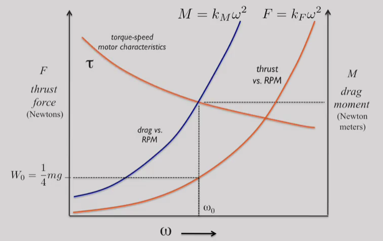
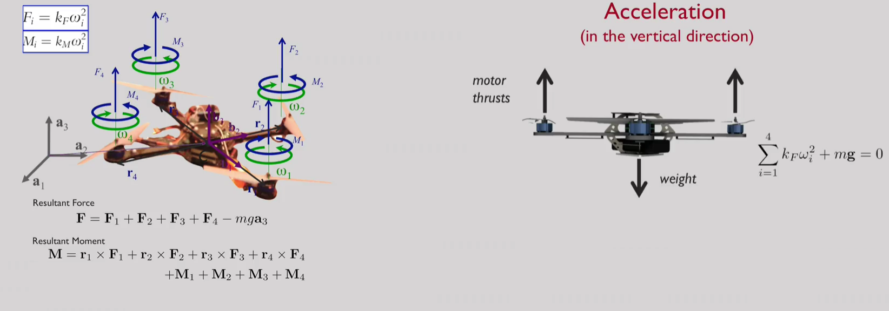

# Energetics and System Design

## Notes

Basic Mechanics:
----------------

If you plot the thrust, or the thrust force, against the RPMs of the motor or the angular velocity. You'll find that this relationship is approximately quadratic. Every time a rotor spins, there's also a drag that the rotor has to overcome. And that drag moment is also quadratic. So if you think about a quad rotor, every rotor has to support roughly one fourth of the weight in equilibrium. Which means by looking at the thrust forces of rpm curve, you can determine speed that'll be required to produce one fourth the weight. So that gives you omega zero the operating speed. But of course, that operating speed produces a drag moment and every rotor has to overcome the drag moment. And that's where motors come in, you have to size the motor, so that they can produce the torque to overcome this drag moment. So when the robot is hovering, the rotor speeds compensate for the weight. Using the weight you can determine the basic operating speed for every rotor. And that in turn tells you what torque you need to apply at every motor. 

If you assume that you know the constant of proportionality (k_F) between the force and the square of the RPM. And the constant of proportionality (k_M) between the drag moment and the square of the RPM. You can calculate the resultant force quite easily. It's the sum of the four thrusts and the gravity force. And if you know where the center of mass is, you can quickly calculate moments about the center of mass. And of course the total moment is obtained by calculating the moments due to the forces exerted by the rotors and the reactions due to the rotors spinning in counterclockwise or clockwise directions. Those reactions are moments, and they add to the net moment. In equilibrium, the resultant force is obviously zero. And the result in moment is also zero. But what happens when these resultant forces in moments are non-zero? Well you get acceleration. So in the vertical direction, again, every motor thrust is the same, and they'll add up to support the weight. But if you increase the motor speeds, then the robot accelerates up. If you decrease the motor speeds, obviously the robot will accelerate down. So a combination of motor thrusts and the weight determines which way the robot accelerates. 

Dynamics and 1-D Linear Control
---------------------------------

So let's think about controlling height. What you would like to do is to drive the robot to a desired vertical position either up or down. Let's use x to measure the vertical displacement. Clearly, the acceleration is given by the second derivative of position. If you look on the left hand side, you'll see the sum of the forces. Let's call *u* the sum of the forces divided by the mass. So you have now a very simple second order differential equation with an input *u* and a variable *x*, such that *u* is equal to the second derivative of *x*. Our goal to control this vehicle is to determine the function *u*, such that the vehicle goes to the desired position *x*. 

## Questions

Why don't all the rotors of a quadrotor spin in the same direction?
- [x] Spinning all rotors in the same direction will cause the robot to constantly rotate.
- [ ] Spinning all rotors in the same direction does not allow the quadrotor to fly upside down.
- [ ] Spinning all rotors in the same direction uses more battery power.
- [ ] Spinning all rotors in the same direction does not allow them to repel rain as efficiently.

A quadrotor is at hover and the speeds of all its motors double, it will
- [x] Accelerate up
- [ ] Accelerate down
- [ ] Rotate clockwise when viewed from above
- [ ] Rotate clockwise when viewed from below
